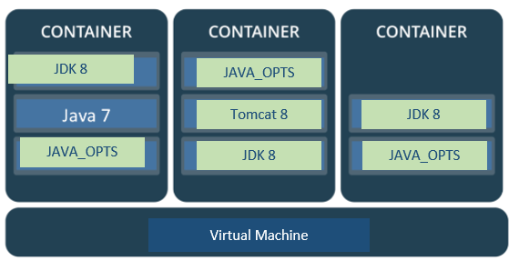
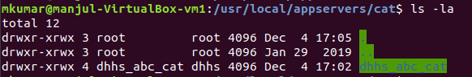

# Application-Provisioning
Reading host-inventory file from source machine to create containers on remotes. CI pipeline then deploy war file and start/stop tomcat instance.

containers(not dockerised yet!):



* Name of the project should be same as given in host-inventory file, any change in name will result in non-execution of playbook.
* project name and group are owner of container, TODO: service principal from AD will take over this?
* Groups can have many project like: dhhs = revenue can have project's name like dhhs_abc, dhhs_abc_EFSBatch, dhhs_def..  etc
* We are copying the tomcat and jdk from their repositories to the application destination, so future patches needs to be done individually on each jdk/tomcat(if any!).
* JAVA_OPTS can be any and they are not comma-separated.
* TODO: KeyStore at /tomcat/conf/server.xml  are they configured with NetScaler or loadBalancer or ... ? 
* TODO: We need to change permissions on file?


host files lives here


### The overall structure looks like


and


```
file: playbook.yaml
Directories:
  * roles (need for input to playbook)
  * group_vars (need for input to playbook)
  * usr/local/appservers (created on control machine for output by playbook)
      * cat
          * dhhs_abc_cat
              * jdk and tomcat directory
```

# How to run playbook

```
ansible-playbook application.yaml -K
```
Where
```-K``` = ask for privilege escalation password.


# output of playbook
This is what resulted at Controlled machine(remote machine, where provisioning is being done).

### **_/usr/local/appservers/_**
 


### **_/usr/local/appservers/cat/_**
 



### **_/usr/local/appservers/cat/dhhs_abc_cat/_**
  


